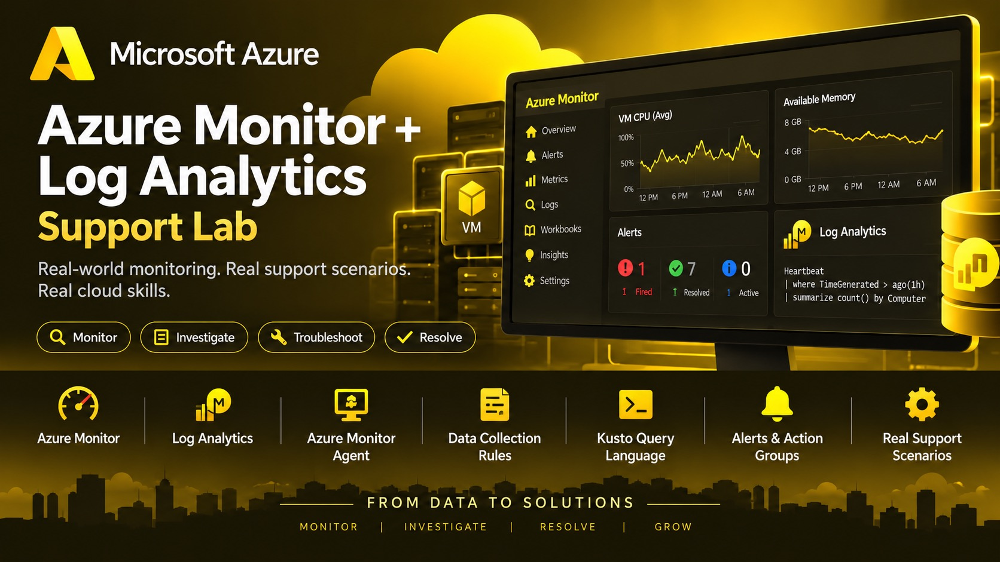
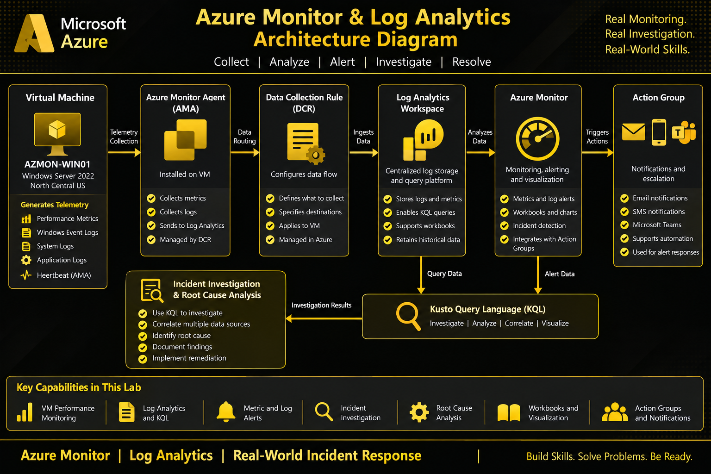
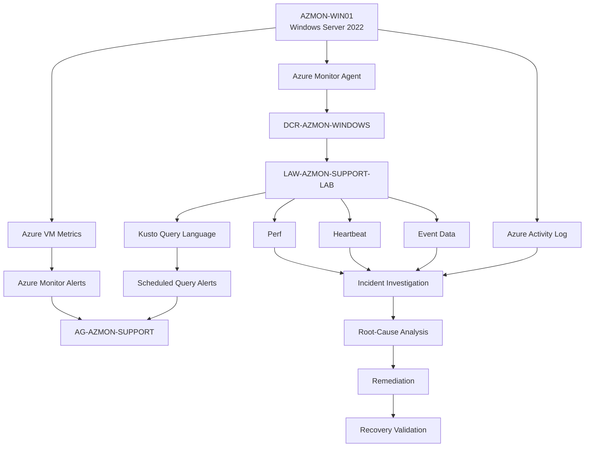
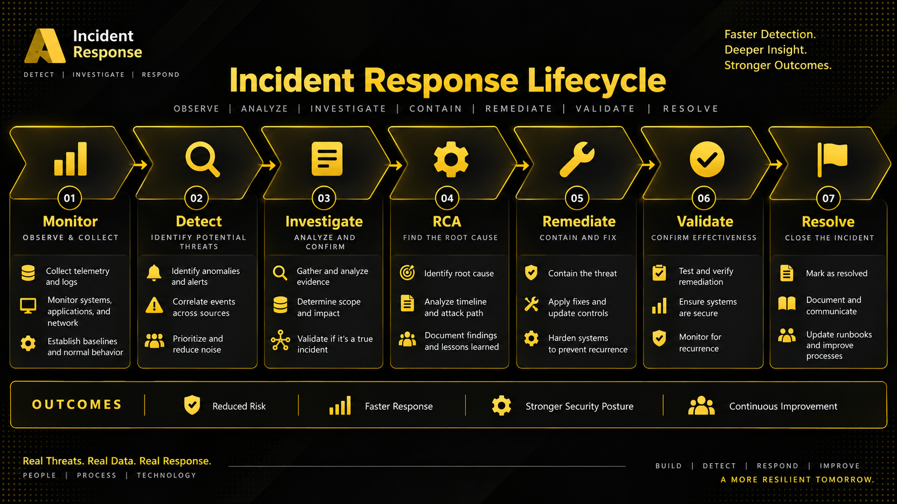
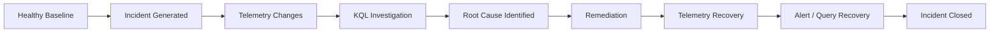

# Azure Monitor + Log Analytics Support Lab

Hands-on Microsoft Azure monitoring and cloud support lab demonstrating Azure Monitor, Log Analytics, Azure Monitor Agent, Data Collection Rules, Kusto Query Language, performance monitoring,
activity logs, alerting, Windows event investigation, controlled incident simulation, root-cause analysis, remediation, and end-to-end recovery validation.

---

## Project Overview

This project simulates real-world Azure cloud support and monitoring incidents using a Windows Server virtual machine connected to Azure Monitor and Log Analytics.

The lab focuses on the operational workflow used by cloud support, systems administration, help desk, and infrastructure teams:

```text
Collect telemetry
      ↓
Detect abnormal behavior
      ↓
Investigate with KQL
      ↓
Correlate guest and Azure data
      ↓
Identify root cause
      ↓
Remediate the condition
      ↓
Validate recovery
      ↓
Document the incident
```

The environment was intentionally designed around one monitored Windows Server so each incident could be generated, investigated, remediated, and verified from beginning to end.

---

# Lab Status

```text
Environment Setup:        COMPLETE
Log Analytics Workspace:  COMPLETE
Azure Monitor Agent:      COMPLETE
Data Collection Rules:    COMPLETE
VM Metrics Monitoring:    COMPLETE
Activity Log Monitoring:  COMPLETE
Azure Monitor Alerts:     COMPLETE
KQL Log Analysis:         COMPLETE
Incident Investigation:   COMPLETE
Root-Cause Analysis:      COMPLETE

Completed Incidents:      7
Documentation Files:      9
KQL Files:                11
Screenshots:              134
```

---

# Environment

## Azure Virtual Machine

```text
Name:
AZMON-WIN01

Operating System:
Windows Server 2022 Datacenter: Azure Edition

Region:
North Central US

VM Size:
Standard_D2als_v6

vCPUs:
2

Memory:
4 GiB
```

---

## Resource Group

```text
RG-AZMON-SUPPORT-LAB
```

---

## Log Analytics Workspace

```text
LAW-AZMON-SUPPORT-LAB
```

---

## Data Collection Rule

```text
DCR-AZMON-WINDOWS
```

---

## Alerting

The lab includes both:

```text
Azure Monitor metric alerts
```

and:

```text
Log Analytics scheduled query alerts
```

including:

```text
ALRT-AZMON-LOW-MEMORY-KQL
```

with the reusable action group:

```text
AG-AZMON-SUPPORT
```

---

# Monitoring Architecture






---

# Technologies Used

- Microsoft Azure
- Azure Portal
- Azure Virtual Machines
- Windows Server 2022
- Azure Monitor
- Log Analytics
- Log Analytics Workspace
- Azure Monitor Agent
- Data Collection Rules
- Azure Activity Log
- Azure Metrics
- Azure Monitor Alerts
- Scheduled Query Rules
- Action Groups
- Kusto Query Language
- PowerShell
- Windows Performance Counters
- Windows Event Log
- Azure VM Run Command
- Git
- GitHub

---

# Core Monitoring Workflow

The lab demonstrates monitoring across several Azure and operating-system layers.

```text
Azure Resource
      ↓
Azure Metrics
      ↓
Guest Operating System
      ↓
Windows Performance Counters
      ↓
Azure Monitor Agent
      ↓
Data Collection Rule
      ↓
Log Analytics Workspace
      ↓
KQL Analysis
      ↓
Alerting
      ↓
Incident Response
```

---

# Data Sources Investigated

## Performance Data

Performance telemetry was queried from:

```text
Perf
```

Examples included:

```text
Processor utilization
Available memory
Logical disk capacity
Disk queue length
Network throughput
```

---

## Agent Health

Azure Monitor Agent connectivity was investigated through:

```text
Heartbeat
```

This allowed the lab to distinguish between:

```text
Healthy VM + missing monitoring telemetry
```

and:

```text
Actual VM availability failure
```

---

## Windows Events

Windows Application events were generated and investigated to demonstrate:

```text
Event creation
Event collection
KQL filtering
Event ID correlation
Severity analysis
Source analysis
Remediation validation
```

---

## Azure Activity Logs

Azure Activity Log data was used to investigate Azure control-plane operations such as:

```text
Virtual machine operations
Resource configuration changes
Administrative actions
Operation status
Caller information
Timestamps
```

---

# Data Collection Rule

The Windows monitoring environment uses:

```text
DCR-AZMON-WINDOWS
```

The collected performance counters included examples such as:

```text
Processor Information\% Processor Time
Memory\Available Bytes
LogicalDisk\Free Megabytes
LogicalDisk\Avg. Disk Queue Length
Network Interface\Bytes Total/sec
```

An important troubleshooting lesson from the lab was to query the actual collected performance-counter inventory before changing the DCR.

---

# KQL Workflow

Kusto Query Language was used throughout the project to:

- Filter telemetry by computer
- Filter by performance object
- Filter by counter name
- Search recent time windows
- Find the latest sample
- Calculate minimum values
- Calculate maximum values
- Calculate averages
- Calculate deltas
- Convert bytes to MB and GB
- Classify health states
- Compare collection and ingestion timestamps
- Identify missing heartbeat
- Analyze Windows events
- Visualize incident timelines
- Build scheduled query alert conditions
- Validate post-remediation recovery

---

# Completed Incident Portfolio

| Incident | Scenario | Primary Monitoring Area | Status |
|---|---|---|---|
| INC-001 | High CPU Utilization | Azure Metrics / Performance | Resolved |
| INC-002 | Missing Heartbeat | Azure Monitor Agent / Heartbeat | Resolved |
| INC-003 | VM Availability | Azure VM / Activity / Heartbeat | Resolved |
| INC-004 | Windows Application Event | Windows Events / Log Analytics | Resolved |
| INC-005 | Disk Space / Storage Capacity | Perf / LogicalDisk | Resolved |
| INC-006 | Memory Pressure | Perf / Memory | Resolved |
| INC-007 | KQL Scheduled Query Alert | Log Analytics / Automated Alerting | Resolved |

---

# INC-001 — High CPU Utilization

Documentation:

[INC-001 — High CPU Utilization](Help-Desk-Tickets/INC-001-High-CPU.md)

The first incident established the core monitoring and incident-response workflow.

The lab generated controlled CPU utilization and investigated the resulting Azure monitoring data.

Skills demonstrated:

```text
Azure VM monitoring
CPU metrics
Performance investigation
Alert validation
Controlled workload generation
Root-cause analysis
Remediation
Recovery verification
```

Incident documentation:

```text
611 lines
```

---

# INC-002 — Missing Heartbeat

Documentation:

[INC-002 — Missing Heartbeat](Help-Desk-Tickets/INC-002-Missing-Heartbeat.md)

This incident simulated interruption of Azure monitoring telemetry.

The investigation focused on determining whether:

```text
The VM was offline
```

or:

```text
The monitoring agent stopped reporting
```

The workflow included:

```text
Heartbeat analysis
Agent validation
Telemetry-gap identification
Azure Monitor Agent troubleshooting
Recovery verification
```

Incident documentation:

```text
1,627 lines
```

---

# INC-003 — Virtual Machine Availability

Documentation:

[INC-003 — VM Availability](Help-Desk-Tickets/INC-003-VM-Availability.md)

This incident simulated Azure VM unavailability through controlled deallocation.

The investigation correlated:

```text
VM resource state
Heartbeat data
Azure Activity Log
Availability timeline
Recovery telemetry
```

This scenario demonstrates how Azure support engineers distinguish:

```text
Monitoring-agent failure
```

from:

```text
Actual infrastructure unavailability
```

Incident documentation:

```text
2,250 lines
```

---

# INC-004 — Windows Application Event Investigation

Documentation:

[INC-004 — Windows Application Event](Help-Desk-Tickets/INC-004-Windows-Event.md)

A controlled Windows Application event was generated on:

```text
AZMON-WIN01
```

The generated event used:

```text
Event ID:
200

Source:
AZMON-AppLab

Log:
Application

Type:
Error
```

The investigation demonstrated:

```text
Windows Event generation
Event collection
Log Analytics ingestion
KQL filtering
Event-source identification
Severity validation
Timeline correlation
Incident closure
```

Incident documentation:

```text
2,201 lines
```

---

# INC-005 — Disk Space / Storage Capacity Monitoring

Documentation:

[INC-005 — Disk Space](Help-Desk-Tickets/INC-005-Disk-Space.md)

This incident simulated storage-capacity reduction on the Windows VM.

Baseline:

```text
C: Total:
126.45 GB

C: Free:
112.26 GB

Free:
88.78%
```

A controlled file was created:

```text
C:\AZMON-Disk-Test.bin
```

Size:

```text
10 GB
```

During the incident:

```text
Free:
102.26 GB

Free Percentage:
80.87%
```

After remediation:

```text
Free:
112.26 GB

Free Percentage:
88.78%
```

Log Analytics independently showed the same reduction and recovery through:

```text
LogicalDisk\Free Megabytes
```

The final timechart demonstrated:

```text
Healthy baseline
      ↓
Approximately 10 GB drop
      ↓
Controlled incident
      ↓
File removed
      ↓
Storage recovered
```

Incident documentation:

```text
2,623 lines
```

---

# INC-006 — Memory Pressure / High Memory Usage

Documentation:

[INC-006 — Memory Pressure](Help-Desk-Tickets/INC-006-Memory-Pressure.md)

This incident simulated controlled physical-memory pressure.

Baseline:

```text
Total Memory:
3.99 GB

Available Memory:
2.79 GB

Memory Used:
30.23%
```

Log Analytics baseline:

```text
Approximately 2933 MB available
```

A controlled PowerShell process allocated approximately:

```text
1024 MB
```

Observed process working set:

```text
Approximately 1105 MB
```

During pressure:

```text
Windows Available:
1.73 GB

Memory Used:
56.59%

Log Analytics Available:
Approximately 1809–1827 MB
```

After remediation:

```text
Windows Available:
2.77 GB

Memory Used:
30.78%

WorkerPresent:
False

Log Analytics:
Approximately 2915 MB
```

The incident also demonstrated a real troubleshooting condition.

The initial query searched for:

```text
Memory\Available MBytes
```

but returned no data.

A performance-counter inventory showed the environment was actually collecting:

```text
Memory\Available Bytes
```

The query was corrected without unnecessarily modifying the Data Collection Rule.

Incident documentation:

```text
2,734 lines
```

---

# INC-007 — Log Analytics Scheduled Query Alert / Low Memory

Documentation:

[INC-007 — Log Analytics Scheduled Query Alert](Help-Desk-Tickets/INC-007-Log-Query-Alert.md)

INC-007 converted KQL troubleshooting logic into automated Azure Monitor detection.

Alert rule:

```text
ALRT-AZMON-LOW-MEMORY-KQL
```

Action group:

```text
AG-AZMON-SUPPORT
```

Threshold:

```text
Available memory < 2048 MB
```

Healthy baseline:

```text
2911 MB
```

Healthy KQL result:

```text
0 rows
```

Controlled incident:

```text
1691 MB
```

Alert condition:

```text
TRUE
```

Azure Monitor state:

```text
FIRED
```

After remediation:

```text
Windows Available:
2696 MB

Log Analytics Available:
2764 MB

KQL Result:
0 rows

Alert State:
RESOLVED
```

The complete lifecycle was validated:

```text
Healthy
      ↓
KQL condition false
      ↓
Scheduled query rule enabled
      ↓
Controlled threshold violation
      ↓
KQL condition true
      ↓
Azure Monitor alert fired
      ↓
Remediation
      ↓
Telemetry recovery
      ↓
KQL condition false
      ↓
Alert automatically resolved
```

Incident documentation:

```text
2,900 lines
```

---

# Incident Progression

The incidents were intentionally designed to increase in complexity.

```text
INC-001
CPU Performance
      ↓
INC-002
Monitoring Agent / Heartbeat
      ↓
INC-003
Infrastructure Availability
      ↓
INC-004
Windows Event Investigation
      ↓
INC-005
Storage Capacity
      ↓
INC-006
Memory Capacity
      ↓
INC-007
Automated KQL Alerting
```

---

# Documentation

The project contains dedicated documentation for the major monitoring components.

## 01 — Environment Setup

[Documentation/01-Environment-Setup.md](Documentation/01-Environment-Setup.md)

Covers:

```text
Azure environment
Resource group
Virtual machine
Monitoring design
Lab architecture
```

---

## 02 — Log Analytics Workspace

[Documentation/02-Log-Analytics-Workspace.md](Documentation/02-Log-Analytics-Workspace.md)

Covers:

```text
Workspace creation
Workspace configuration
Log storage
Query environment
Monitoring integration
```

---

## 03 — Azure Monitor Agent + Data Collection Rule

[Documentation/03-Azure-Monitor-Agent-DCR.md](Documentation/03-Azure-Monitor-Agent-DCR.md)

Covers:

```text
Azure Monitor Agent
Agent deployment
Data Collection Rules
Performance counters
Telemetry collection
```

---

## 04 — VM Metrics Monitoring

[Documentation/04-VM-Metrics-Monitoring.md](Documentation/04-VM-Metrics-Monitoring.md)

Covers:

```text
CPU metrics
VM monitoring
Metric charts
Performance interpretation
```

---

## 05 — Activity Logs + Diagnostics

[Documentation/05-Activity-Logs-Diagnostics.md](Documentation/05-Activity-Logs-Diagnostics.md)

Covers:

```text
Azure Activity Log
Administrative operations
Resource changes
Operation status
Diagnostic investigation
```

---

## 06 — Azure Monitor Alerts

[Documentation/06-Azure-Monitor-Alerts.md](Documentation/06-Azure-Monitor-Alerts.md)

Covers:

```text
Alert rules
Conditions
Thresholds
Action groups
Severity
Alert lifecycle
```

---

## 07 — KQL Log Analysis

[Documentation/07-KQL-Log-Analysis.md](Documentation/07-KQL-Log-Analysis.md)

Covers:

```text
Kusto Query Language
Filtering
Aggregation
Time windows
Telemetry analysis
Operational queries
```

---

## 08 — Incident Investigation

[Documentation/08-Incident-Investigation.md](Documentation/08-Incident-Investigation.md)

Covers:

```text
Support workflow
Evidence collection
Telemetry correlation
Troubleshooting
Incident validation
```

---

## 09 — Root-Cause Analysis

[Documentation/09-Root-Cause-Analysis.md](Documentation/09-Root-Cause-Analysis.md)

Covers:

```text
Symptom identification
Evidence correlation
Root-cause isolation
Remediation
Recovery validation
Incident closure
```

---

# KQL Query Library

Reusable KQL queries are stored in:

```text
KQL/
```

The project currently contains:

```text
11 KQL files
```

---

## Activity Log Queries

[Activity-Log-Queries.kql](KQL/Activity-Log-Queries.kql)

Used for Azure control-plane operation investigation.

---

## Disk Space Queries

[Disk-Space-Queries.kql](KQL/Disk-Space-Queries.kql)

Used for:

```text
Logical disk free space
Capacity investigation
Storage incident timelines
Recovery validation
```

---

## Heartbeat Queries

[Heartbeat-Queries.kql](KQL/Heartbeat-Queries.kql)

Used for general Azure Monitor Agent heartbeat analysis.

---

## Incident Investigation Queries

[Incident-Investigation-Queries.kql](KQL/Incident-Investigation-Queries.kql)

Reusable investigation queries for cross-incident troubleshooting.

---

## Log Query Alert Queries

[Log-Query-Alert-Queries.kql](KQL/Log-Query-Alert-Queries.kql)

Used for:

```text
Low-memory detection
State classification
Scheduled query alerts
Recovery verification
```

---

## Memory Pressure Queries

[Memory-Pressure-Queries.kql](KQL/Memory-Pressure-Queries.kql)

Used for:

```text
Available memory
Memory timelines
Minimum and maximum memory
Pressure detection
Recovery validation
```

---

## Missing Heartbeat Queries

[Missing-Heartbeat-Queries.kql](KQL/Missing-Heartbeat-Queries.kql)

Used specifically for the monitoring interruption incident.

---

## Performance Queries

[Performance-Queries.kql](KQL/Performance-Queries.kql)

Reusable VM performance queries.

---

## VM Availability Queries

[VM-Availability-Queries.kql](KQL/VM-Availability-Queries.kql)

Used to investigate:

```text
VM availability
Heartbeat state
Controlled deallocation
Recovery
```

---

## Windows Event Incident Queries

[Windows-Event-Incident-Queries.kql](KQL/Windows-Event-Incident-Queries.kql)

Used for the controlled Windows event incident.

---

## Windows Event Queries

[Windows-Event-Queries.kql](KQL/Windows-Event-Queries.kql)

Reusable Windows event investigation queries.

---

# Example KQL — Latest Available Memory

```kusto
Perf
| where TimeGenerated > ago(30m)
| where Computer =~ "AZMON-WIN01"
| where ObjectName =~ "Memory"
| where CounterName =~ "Available Bytes"
| top 1 by TimeGenerated desc
| project TimeGenerated,
          Computer,
          AvailableMB=round(CounterValue / 1024.0 / 1024.0,0),
          AvailableGB=round(CounterValue / 1024.0 / 1024.0 / 1024.0,2)
```

---

# Example KQL — Low-Memory Detection

```kusto
Perf
| where TimeGenerated > ago(5m)
| where Computer =~ "AZMON-WIN01"
| where ObjectName =~ "Memory"
| where CounterName =~ "Available Bytes"
| summarize arg_max(TimeGenerated, CounterValue) by Computer
| extend AvailableMB=CounterValue / 1024.0 / 1024.0
| where AvailableMB < 2048
| project TimeGenerated,
          Computer,
          AvailableMB=round(AvailableMB,0)
```

This query was used as the basis for:

```text
ALRT-AZMON-LOW-MEMORY-KQL
```

---

# Example KQL — Memory Health Classification

```kusto
Perf
| where TimeGenerated > ago(30m)
| where Computer =~ "AZMON-WIN01"
| where ObjectName =~ "Memory"
| where CounterName =~ "Available Bytes"
| extend AvailableMB=CounterValue / 1024.0 / 1024.0
| extend State=iff(AvailableMB < 2048, "LOW MEMORY", "HEALTHY")
| project TimeGenerated,
          Computer,
          AvailableMB=round(AvailableMB,0),
          State
| order by TimeGenerated desc
```

---

# Example KQL — Incident Timeline

```kusto
Perf
| where TimeGenerated > ago(60m)
| where Computer =~ "AZMON-WIN01"
| where ObjectName =~ "Memory"
| where CounterName =~ "Available Bytes"
| summarize AvailableMB=avg(CounterValue) / 1024.0 / 1024.0
    by bin(TimeGenerated,1m)
| order by TimeGenerated asc
| render timechart
```

---

# Screenshot Evidence

The repository contains:

```text
134 screenshots
```

Evidence includes:

```text
Azure resource configuration
Log Analytics workspace configuration
Azure Monitor Agent onboarding
Data Collection Rule configuration
VM metrics
Activity logs
Alert rules
Action groups
KQL results
PowerShell validation
Incident generation
Incident timelines
Fired alerts
Remediation
Recovery validation
Resolved alerts
```

Screenshots are organized by monitoring phase and incident under:

```text
Screenshots/
```

---

# Example Incident Evidence Flow

A typical incident contains evidence for:

```text
01 — Healthy baseline
      ↓
02 — Detection logic
      ↓
03 — Incident generation
      ↓
04 — Local validation
      ↓
05 — Azure telemetry confirmation
      ↓
06 — Timeline visualization
      ↓
07 — Root-cause identification
      ↓
08 — Remediation
      ↓
09 — Recovery validation
      ↓
10 — Incident closure
```

---

# Support Troubleshooting Methodology

The lab follows a repeatable troubleshooting method.

## 1. Establish Baseline

Determine the expected healthy state.

Examples:

```text
Normal CPU
Normal memory
Normal disk capacity
Recent heartbeat
Healthy VM availability
Expected event volume
```

---

## 2. Confirm the Symptom

Validate that the reported condition actually exists.

---

## 3. Identify the Monitoring Layer

Determine whether the issue exists at:

```text
Azure resource layer
Guest OS layer
Agent layer
Data Collection Rule layer
Log Analytics layer
Alerting layer
```

---

## 4. Query the Evidence

Use KQL and Azure monitoring data to isolate the abnormal behavior.

---

## 5. Correlate Multiple Sources

Where possible, compare:

```text
Windows
Azure Metrics
Heartbeat
Perf
Activity Log
Azure Alerts
```

---

## 6. Identify Root Cause

Separate:

```text
symptom
```

from:

```text
underlying cause
```

---

## 7. Remediate

Perform the lowest-risk action appropriate to the identified cause.

---

## 8. Validate Recovery

Do not close the incident immediately after the remediation command succeeds.

Confirm:

```text
Guest recovery
Telemetry recovery
Query recovery
Alert recovery
```

---

## 9. Document Closure

Record:

```text
What happened
What evidence confirmed it
What caused it
What was changed
How recovery was verified
```

---

# Key Troubleshooting Lessons

## Query No Results Does Not Always Mean Monitoring Is Broken

During memory investigation, the initial KQL query returned no records.

The actual issue was:

```text
Incorrect counter name
```

not:

```text
Broken Azure Monitor Agent
```

---

## Inventory Telemetry Before Changing Configuration

The existing `Perf` data was queried before modifying the Data Collection Rule.

This avoided an unnecessary configuration change.

---

## Monitoring and Resource State Are Different

A missing heartbeat may indicate:

```text
Agent interruption
```

while an unavailable VM may indicate:

```text
Actual infrastructure state change
```

These conditions require different troubleshooting paths.

---

## Telemetry Has Collection and Ingestion Delay

Immediately after remediation, Azure may still display an older state.

Support engineers should understand the path:

```text
Resource changes
      ↓
Agent collects sample
      ↓
Telemetry transmitted
      ↓
Workspace ingests sample
      ↓
KQL sees new state
      ↓
Alert engine reevaluates
```

---

## Alert Resolution Can Lag Resource Recovery

INC-007 demonstrated that the Windows server recovered before Azure Monitor displayed:

```text
Resolved
```

This is expected behavior with scheduled query alert evaluation.

---

## Correlate the Correct Alert Instance

Multiple instances of the same alert rule can exist.

The current incident should be correlated using:

```text
Alert timestamp
Detection timestamp
Remediation timestamp
Recovery timestamp
Resolved timestamp
```

---

# Controlled Incident Philosophy

The lab intentionally generated controlled faults to validate monitoring.

Examples included:

```text
CPU pressure
Monitoring interruption
VM deallocation
Windows application error
Disk-space reduction
Memory pressure
Low-memory alert condition
```

Controlled tests were designed to be:

```text
Temporary
Reversible
Observable
Safe for the lab environment
Easy to validate
```

---

# Incident Response Lifecycle






---

# Skills Demonstrated

## Azure Administration

- Azure resource groups
- Azure virtual machines
- Azure Portal
- Azure resource monitoring
- Azure Activity Log

## Monitoring

- Azure Monitor
- VM metrics
- Log Analytics
- Azure Monitor Agent
- Data Collection Rules
- Windows performance counters
- Heartbeat monitoring

## Alerting

- Metric alerts
- Scheduled query alerts
- Alert rules
- Action groups
- Severity levels
- Threshold configuration
- Automatic resolution
- Alert lifecycle investigation

## Kusto Query Language

- `where`
- `project`
- `extend`
- `summarize`
- `arg_max`
- `min`
- `max`
- `avg`
- `count`
- `iff`
- `ago`
- `bin`
- `order by`
- `top`
- `render timechart`
- `ingestion_time()`

## Windows Administration

- Windows Server 2022
- PowerShell
- CIM
- Windows Event Log
- Performance counters
- Process investigation
- CPU utilization
- Memory utilization
- Storage capacity
- VM Run Command

## Troubleshooting

- Incident triage
- Baseline analysis
- Performance troubleshooting
- Agent troubleshooting
- Availability troubleshooting
- Event investigation
- Capacity troubleshooting
- Root-cause analysis
- Evidence correlation
- Recovery validation

## Support Operations

- Incident documentation
- Evidence management
- Alert correlation
- Monitoring validation
- Remediation planning
- Incident closure
- Git version control
- GitHub documentation

---

# Repository Structure

```text
Azure-Monitor-Log-Analytics-Support-Lab/
│
├── Documentation/
│   ├── 01-Environment-Setup.md
│   ├── 02-Log-Analytics-Workspace.md
│   ├── 03-Azure-Monitor-Agent-DCR.md
│   ├── 04-VM-Metrics-Monitoring.md
│   ├── 05-Activity-Logs-Diagnostics.md
│   ├── 06-Azure-Monitor-Alerts.md
│   ├── 07-KQL-Log-Analysis.md
│   ├── 08-Incident-Investigation.md
│   └── 09-Root-Cause-Analysis.md
│
├── Help-Desk-Tickets/
│   ├── INC-001-High-CPU.md
│   ├── INC-002-Missing-Heartbeat.md
│   ├── INC-003-VM-Availability.md
│   ├── INC-004-Windows-Event.md
│   ├── INC-005-Disk-Space.md
│   ├── INC-006-Memory-Pressure.md
│   └── INC-007-Log-Query-Alert.md
│
├── KQL/
│   ├── Activity-Log-Queries.kql
│   ├── Disk-Space-Queries.kql
│   ├── Heartbeat-Queries.kql
│   ├── Incident-Investigation-Queries.kql
│   ├── Log-Query-Alert-Queries.kql
│   ├── Memory-Pressure-Queries.kql
│   ├── Missing-Heartbeat-Queries.kql
│   ├── Performance-Queries.kql
│   ├── VM-Availability-Queries.kql
│   ├── Windows-Event-Incident-Queries.kql
│   └── Windows-Event-Queries.kql
│
├── Screenshots/
│   └── 134 monitoring and incident screenshots
│
└── README.md
```

---

# Portfolio Value

This project was built to demonstrate practical skills relevant to roles such as:

```text
Azure Support Engineer
Cloud Support Specialist
Technical Support Engineer
IT Support Specialist
Systems Administrator
Cloud Administrator
Help Desk Technician
Infrastructure Support Technician
Microsoft Support Specialist
NOC / Monitoring Analyst
```

Rather than documenting only successful Azure resource creation, the project emphasizes:

```text
something breaks
      ↓
support investigates
      ↓
evidence is gathered
      ↓
root cause is identified
      ↓
the issue is fixed
      ↓
recovery is proven
```

---

# Interview Talking Points

## What is Azure Monitor?

Azure Monitor provides monitoring and observability across Azure resources, applications, operating systems, metrics, logs, and alerts.

In this lab I used Azure Monitor to investigate:

```text
CPU
VM availability
memory
storage
activity logs
agent health
alerts
```

---

## What is Log Analytics?

Log Analytics provides a query environment for analyzing monitoring data stored in an Azure Log Analytics workspace.

I used KQL to investigate:

```text
Heartbeat
Perf
Windows events
resource state
memory
disk capacity
incident timelines
```

---

## What is Azure Monitor Agent?

Azure Monitor Agent collects guest operating-system monitoring data and forwards it according to Data Collection Rules.

In this environment it collected Windows telemetry from:

```text
AZMON-WIN01
```

into:

```text
LAW-AZMON-SUPPORT-LAB
```

---

## What is a Data Collection Rule?

A Data Collection Rule determines what monitoring data should be collected and where it should be sent.

The lab used:

```text
DCR-AZMON-WINDOWS
```

to collect Windows performance data.

---

## How did you troubleshoot missing monitoring data?

I first determined whether the VM itself was unavailable or whether only the monitoring telemetry had stopped.

I used:

```text
Heartbeat
VM state
Azure Monitor Agent status
Activity Log
recent telemetry timestamps
```

to isolate the problem.

---

## How did you troubleshoot memory pressure?

I compared:

```text
Windows physical memory
process working set
Memory\Available Bytes
Log Analytics Perf data
KQL timelines
```

The controlled worker consumed approximately 1 GB and the reduction was visible both locally and in Log Analytics.

---

## How did you test alerting?

I built a scheduled KQL query rule that detected when:

```text
Available memory < 2048 MB
```

I validated:

```text
healthy state
alert condition false
controlled threshold violation
alert firing
remediation
telemetry recovery
condition clearing
automatic alert resolution
```

---

# Project Outcome

The completed lab demonstrates the ability to:

```text
Deploy monitoring
Collect telemetry
Query operational data
Build alerts
Simulate incidents
Investigate symptoms
Identify root causes
Remediate failures
Validate recovery
Document incidents
```

The final environment contains:

```text
9 monitoring documentation files
7 completed support incidents
11 reusable KQL files
134 screenshots
Azure metric monitoring
Log Analytics monitoring
Azure Monitor Agent telemetry
Data Collection Rules
Azure Activity Log investigation
Metric alerting
KQL scheduled query alerting
Windows Server troubleshooting
End-to-end incident validation
```

---

# Final Status

```text
Azure Monitor Environment:
COMPLETE

Log Analytics Environment:
COMPLETE

Azure Monitor Agent:
VERIFIED

Data Collection Rule:
VERIFIED

Performance Monitoring:
VERIFIED

Heartbeat Monitoring:
VERIFIED

Activity Log Monitoring:
VERIFIED

Windows Event Monitoring:
VERIFIED

Metric Alerting:
VERIFIED

KQL Scheduled Query Alerting:
VERIFIED

Incident Investigations:
7 COMPLETE

Reusable KQL Library:
11 FILES

Screenshot Evidence:
134

Repository Status:
PORTFOLIO READY
```
